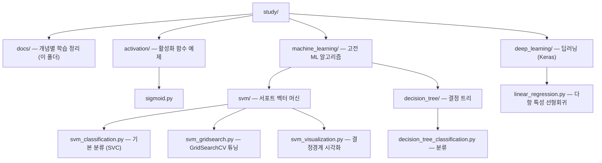

# 학습 개념 정리 (docs)

개념별 학습 노트 모음. 각 문서는 관련 코드 디렉토리와 연결된다.

## 목차

| 개념 | 문서 | 코드 |
|------|------|------|
| Pandas 기초 (DataFrame 사용법) | [pandas_basics.md](./pandas_basics.md) | (여러 예제 공통) |
| EDA 체크리스트 (탐색적 데이터 분석) | [eda_checklist.md](./eda_checklist.md) | (KNN · SVM · 결정트리 사례) |
| 전처리기 fit/transform 원리 | [preprocessing_fit_transform.md](./preprocessing_fit_transform.md) | (LabelEncoder · Scaler) |
| 활성화 함수 (시그모이드 등) | [activation_functions.md](./activation_functions.md) | [`../activation/`](../activation/) |
| 로지스틱 회귀 (분류 · 딥러닝의 전신) | [logistic_regression.md](./logistic_regression.md) | (개념) |
| SVM (분류 · 튜닝 · 시각화) | [svm.md](./svm.md) | [`../machine_learning/svm/`](../machine_learning/svm/) |
| 디시전 트리 (결정 트리) | [decision_tree.md](./decision_tree.md) | [`../machine_learning/decision_tree/`](../machine_learning/decision_tree/) |
| 모델 비교 (선형회귀 vs 로지스틱 vs SVM) | [model_comparison.md](./model_comparison.md) | (개념) |
| 딥러닝 선형회귀 (Keras) | [deep_learning_linear_regression.md](./deep_learning_linear_regression.md) | [`../deep_learning/`](../deep_learning/) |

## 디렉토리 구조

폴더는 모두 "분야/카테고리" 레벨로 통일한다. 개별 알고리즘은 해당 분야 폴더 아래에 둔다.

