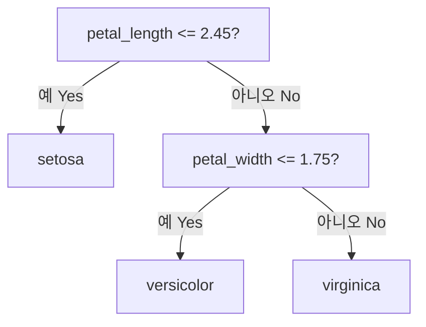
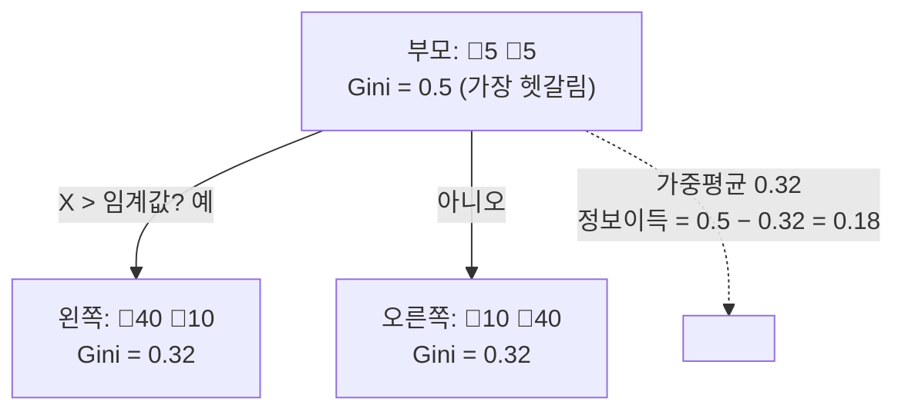
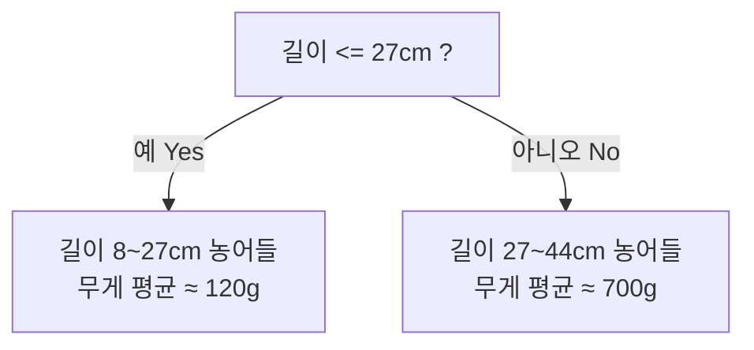

# 디시전 트리 (Decision Tree, 결정 트리)

> 관련 코드: [`../machine_learning/decision_tree/decision_tree_classification.py`](../machine_learning/decision_tree/decision_tree_classification.py)

## 개념

데이터를 **질문(조건)으로 반복 분할**하면서 트리 형태로 분류/회귀하는 모델.
각 노드에서 "어떤 특성이 가장 잘 나누는가"를 기준으로 데이터를 두 갈래로 쪼개고,
더 이상 나눌 필요가 없을 때까지 반복한다.



- **루트 노드(root)**: 첫 분기점
- **내부 노드(internal)**: 조건 분기
- **리프 노드(leaf)**: 최종 예측값(클래스/값)

## 불순도 (Impurity)

"한 노드 안에 여러 클래스가 얼마나 섞여 있는가"를 나타내는 지표.
분할은 **불순도가 가장 많이 줄어드는** 방향으로 이뤄진다.

| 기준 | 설명 |
|------|------|
| 지니 불순도 (Gini) | 사이킷런 기본값. 계산이 빠름 |
| 엔트로피 (Entropy) | 정보 이득(Information Gain) 기반 |

### 지니 불순도 (Gini Impurity) 자세히

$$ G = 1 - \sum_{i=1}^{c} p_i^2 $$

한 줄 정의(확률론적): **노드에서 무작위로 뽑은 두 샘플의 클래스가 서로 다를 확률.**

수식을 항별로 뜯어보면:

| 기호 | 의미 |
|------|------|
| $p_i$ | 클래스 $i$의 비율. 노드에 100개 중 A 70개·B 30개면 $p_A=0.7,\ p_B=0.3$. 노드에서 한 샘플을 뽑았을 때 클래스 $i$일 확률. |
| $p_i^2$ | 같은 클래스를 두 번 연속 뽑을 확률 (복원 추출). 비율을 제곱한다는 건 곧 "두 번 다 클래스 $i$" 사건. |
| $\sum_{i=1}^{c} p_i^2$ | 모든 클래스($c$개)에 대해 합산 → "아무 클래스든 두 번 연속 **같은** 클래스가 나올 확률". 노드가 한 클래스로 순수하면 1에 가까움. |
| $1 - \sum p_i^2$ | 전체 확률 1에서 "같을 확률"을 뺀 값 → "두 번 뽑았을 때 클래스가 **다를** 확률" = 불순도. |

**해석**: 노드가 섞여 있을수록 다른 클래스가 나올 확률이 커져 지니 값이 커지고,
한 클래스로 통일될수록 0에 가까워진다.

**빠른 검산 (이진 분류)**

| 노드 구성 | 계산 | 지니 |
|-----------|------|------|
| 50 : 50 (완전히 섞임) | $1 - (0.5^2 + 0.5^2) = 1 - 0.5$ | **0.5** (이진에서 최댓값) |
| 100 : 0 (완전히 순수) | $1 - (1^2 + 0^2) = 1 - 1$ | **0** (최솟값) |

> 즉 지니는 **0(완전 순수) ~ 0.5(이진 최대 혼합)** 범위를 가지며,
> 분할은 자식 노드들의 (가중) 지니 합이 가장 작아지는 방향으로 일어난다.

## 분할 기준 선택 — 정보 이득 (Information Gain)

트리는 매 노드에서 "어떤 특성을, 어떤 임계값에서 자를까"를 정해야 한다.
후보 분할을 전부 따져보고 **분할 후 불순도가 가장 많이 줄어드는** 분할을 고른다.
이 감소량을 **정보 이득(information gain)** 이라고 한다.

$$ \Delta = Gini_{\text{부모}} - \left( \frac{n_{\text{left}}}{n} Gini_{\text{left}} + \frac{n_{\text{right}}}{n} Gini_{\text{right}} \right) $$

- $n$: 부모 노드의 샘플 수, $n_{\text{left}}$ / $n_{\text{right}}$: 각 자식의 샘플 수
- 분할 후 불순도는 자식 노드들의 **가중 평균**(샘플 수 비율로 가중)으로 계산한다.
- 이 $\Delta$가 가장 큰 분할을 선택 → "자르고 나니 양쪽이 가장 깨끗하게 정리되는" 분할.

### 왜 단순 합이 아니라 가중 평균인가
자식 노드 크기가 다를 수 있기 때문이다. 한쪽에 90개, 다른 쪽에 10개가 들어가면
90개짜리 노드의 불순도가 전체에 더 큰 영향을 줘야 공정하다. 그래서 샘플 수 비율로 가중치를 준다.

### 수치 예시
부모: A 50개, B 50개 → $Gini_{\text{부모}} = 1 - (0.5^2 + 0.5^2) = 0.5$

특성 X로 잘랐더니:

| 자식 | 구성 | 지니 |
|------|------|------|
| 왼쪽 (50개) | A 40, B 10 | $1 - (0.8^2 + 0.2^2) = 0.32$ |
| 오른쪽 (50개) | A 10, B 40 | (대칭) $0.32$ |

- 분할 후 가중 평균 $= \frac{50}{100}(0.32) + \frac{50}{100}(0.32) = 0.32$
- 정보 이득 $\Delta = 0.5 - 0.32 = \mathbf{0.18}$

이 0.18을 다른 후보 분할들의 정보 이득과 비교해 **가장 큰 값을 내는 분할을 채택**한다.
잎이 충분히 순수해지거나 하이퍼파라미터 제한(`max_depth` 등)에 걸릴 때까지
이 과정을 **재귀적으로 반복**하는 것이 트리 학습이다.

### 핵심 직관 — 지니의 두 역할
지니는 "섞임"을 점수로 매기고, 자른 뒤 그 점수가 가장 많이 줄어드는 쪽으로 자른다.



- **자(척도)**: 한 노드가 얼마나 섞였는지 재는 도구
- **나침반**: "어느 방향으로 잘라야 가장 덜 섞이게 되나"를 가리키는 비교 기준

즉 "지니가 작을수록 좋다 = 색이 덜 섞일수록 좋다 = 예측이 확실해진다"이고,
트리는 매 단계 모든 후보 분할을 평가해 **가장 좋은 하나를 고르는 탐욕적(greedy) 선택**으로
한 칸씩 나아간다.

### 주의 — 국소 기준 ≠ 전체 목표
"지니가 작을수록 좋다"는 **각 분할을 고르는 국소적 기준**으로는 맞다.
하지만 모든 잎의 지니를 0까지 끌고 가면 트리가 학습 데이터를 통째로 외운 **과적합** 상태가 된다.
트리 전체로 보면 적당한 선에서 멈추는 것(가지치기, 깊이 제한)이 일반화에 더 좋다.
→ **학습 단계의 국소 목표(순수도 최대화)와 일반화 목표가 갈라지는 지점.**

## 핵심 하이퍼파라미터

| 파라미터 | 의미 | 작게 하면 | 크게/깊게 하면 |
|----------|------|-----------|----------------|
| `max_depth` | 트리 최대 깊이 | 과소적합 ↑ | 과적합 ↑ |
| `min_samples_split` | 노드를 분할하는 최소 샘플 수 | 과적합 ↑ | 과소적합 ↑ |
| `min_samples_leaf` | 리프가 가져야 할 최소 샘플 수 | 과적합 ↑ | 과소적합 ↑ |
| `criterion` | 불순도 기준 (`gini` / `entropy`) | - | - |

> 트리는 제한을 두지 않으면 학습 데이터를 완전히 외워 **과적합**되기 쉽다.
> → `max_depth` 등으로 **가지치기(pruning)** 가 중요.

### 기본값(default) vs 직접 설정 비교

`DecisionTreeClassifier`에 인자를 줄 때, 어떤 값은 **기본값과 똑같아서 안 써도 그만**이고
어떤 값은 **일부러 바꾼 설정**이다. 아래는 결정트리 예제의 주석 처리된 설정과 sklearn 기본값 비교.

```python
DT_model = tree.DecisionTreeClassifier(
    criterion='gini',
    max_depth=4,
    min_samples_leaf=2,
    min_samples_split=2,
    random_state=70,
)
```

| 코드에 쓴 값 | sklearn 기본값 | 같은가? | 효과 |
|---|---|---|---|
| `criterion='gini'` | `'gini'` | ✅ 같음 | 불순도 기준 (기본이 지니) |
| `max_depth=4` | `None` | ❌ 다름 | 기본은 제한 없음(끝까지 분할) → 깊이 4로 제한해 **가지치기** |
| `min_samples_leaf=2` | `1` | ❌ 다름 | 데이터 1개짜리 잎(노이즈 과민) 방지 |
| `min_samples_split=2` | `2` | ✅ 같음 | 노드 분할 최소 샘플 (기본과 동일) |
| `random_state=70` | `None` | ❌ 다름 | 무작위 요소 고정 → **매번 같은 트리(재현성)**. 숫자 자체는 의미 없음 |

- **기본값 그대로**: `criterion='gini'`, `min_samples_split=2` → 안 써도 동일
- **일부러 바꾼 값**: `max_depth=4`, `min_samples_leaf=2`(과적합 방지), `random_state=70`(재현성)

> 참고: 예제의 실제 실행 코드는 `tree.DecisionTreeClassifier()` 로 **전부 기본값**이다.
> 즉 `max_depth=None`이라 제한 없이 끝까지 자라는 **과적합 위험 트리**다.
> 위 주석 설정을 풀면 가지치기된 모델이 된다.

## 기본 사용법 (예시)

```python
from sklearn.tree import DecisionTreeClassifier

model = DecisionTreeClassifier(
    criterion='gini',
    max_depth=3,
    random_state=42,
)
model.fit(train_x, train_y)
pred = model.predict(test_x)
```

## 특성 중요도 (Feature Importance)

트리는 어떤 특성이 예측에 많이 기여했는지 수치로 알려준다 → 해석이 쉬운 모델.

```python
model.feature_importances_
```

## 시각화

### 1) 트리 구조도 — `plot_tree`
모델이 만든 if-else 분기 규칙을 트리 그림으로 그린다.

```python
from sklearn.tree import plot_tree
plot_tree(model, feature_names=..., class_names=..., filled=True)
```

### 2) 결정 표면(decision surface) — 모델이 공간을 어떻게 나눴나

> 관련 코드: [`../../20260608/DecisionTree_모델분류.py`](../../20260608/DecisionTree_모델분류.py) 의 `display_decison_surfaced`

특성이 2개일 때, 그 2차원 공간(여기선 경도×위도 = 서울 지도)을 모델이 **권역별로 어떻게
칠하는지** 색으로 보여준다. 핵심 아이디어는 [SVM 결정경계 시각화](./svm.md)와 **동일**하다:
**공간을 촘촘한 격자점으로 덮고, 모든 점을 예측시켜, 예측 결과에 따라 색을 칠한다.**

```python
def display_decison_surfaced(clf, X, y):
    # 1) 그릴 범위 (데이터보다 살짝 넓게 ±0.01)
    x_min = X['longitude'].min() - 0.01;  x_max = X['longitude'].max() + 0.01
    y_min = X['latitude'].min()  - 0.01;  y_max = X['latitude'].max()  + 0.01

    # 2) 0.001 간격 촘촘한 격자 생성 → xx.shape=(237,322) ≈ 76,000개 점
    xx, yy = np.meshgrid(np.arange(x_min, x_max, 0.001),
                         np.arange(y_min, y_max, 0.001))

    # 3) 모든 격자점을 예측 → 다시 격자 모양으로 복원
    Z = clf.predict(np.column_stack([xx.ravel(), yy.ravel()]))
    Z = Z.reshape(xx.shape)

    # 4) 예측 권역별로 색칠 → 결정 경계가 색 경계로 드러남
    plt.contourf(xx, yy, Z, cmap=plt.cm.RdYlBu)

    # 5) 관심 좌표 한 점 찍어 어느 권역에 떨어지는지 확인
    plt.scatter(126.9367, 37.5562, c='blue', marker='^')
    plt.xlabel('longitude'); plt.ylabel('latitude')
```

| 단계 | 하는 일 | 핵심 함수 |
|------|---------|-----------|
| 1 | 그릴 지도 범위 결정 (여백 ±0.01) | `.min()` / `.max()` |
| 2 | 촘촘한 격자점 약 7.6만 개 생성 | `np.meshgrid`, `np.arange` |
| 3 | 모든 점 예측 → 격자 모양 복원 | `clf.predict`, `ravel`, `reshape` |
| 4 | 예측 권역별 색칠 (결정 경계 표현) | `plt.contourf` |
| 5 | 관심 좌표 한 점 표시 | `plt.scatter` |

- `ravel()`: 격자 `(237,322)`를 1차원으로 펴서 `predict`가 받는 `(점 수, 2)` 모양으로 만든다.
- `reshape(xx.shape)`: 1차원 예측 결과를 다시 격자 모양으로 되돌려 `contourf`에 넘긴다.
- **`plot_tree`(규칙 그림)와 차이**: 결정 표면은 데이터 공간에서 경계를 **직접 색으로** 보여줘
  모델이 학습한 영역 분할을 직관적으로 확인할 수 있다. 단, **특성이 2개일 때만** 평면에 그릴 수 있다.

> 같은 기법을 SVM(꽃잎 길이×너비 공간)에 적용한 예는 [svm.md](./svm.md)의
> "결정경계(등고선) 시각화" 참고. **격자 → 예측 → 등고선** 흐름은 모델 종류와 무관하게 동일하다.

## 특성(feature) vs 식별자(identifier), 그리고 train/test 호환 조건

> 관련 코드: [`../../20260608/DecisionTree_모델분류.py`](../../20260608/DecisionTree_모델분류.py)
> — 서울 자치구 좌표로 학습하고, 동(洞) 좌표로 테스트하는 권역 분류 예제.

### 헷갈리기 쉬운 점
이 예제는 `district`(구 이름) 리스트를 train, `dong`(동 이름) 리스트를 test로 쓴다.
"단위가 다른데 어떻게 train/test가 되지?"라는 의문이 들 수 있지만,
**구 이름·동 이름은 모델 입력으로 쓰이지 않는다.** 학습 직전에 버려진다.

```python
train_df.drop(['district'], axis=1, inplace=True)   # 구 이름 버림
test_df.drop(['dong'],     axis=1, inplace=True)     # 동 이름 버림

train_x = train_df[['longitude','latitude']]   # 실제 특성 = 경도, 위도
train_y = train_df[['label']]                  # 실제 정답 = 권역
test_x  = test_df[['longitude','latitude']]    # 똑같이 경도, 위도
test_y  = test_df[['label']]                   # 똑같이 권역
```

| | train | test |
|---|---|---|
| 특성 X | (경도, 위도) | (경도, 위도) ← **같은 단위** |
| 정답 y | 4개 권역 라벨 | 4개 권역 라벨 ← **같은 클래스** |
| `district` / `dong` | drop (안 씀) | drop (안 씀) |

`district`·`dong`은 각 행을 사람이 알아보기 위한 **식별자(이름표)**일 뿐 특성이 아니다.
그래서 단위가 달라도 무관하다. 모델 입장에선 둘 다 "(경도,위도) → 권역"으로 **구조가 동일**하다.

### train/test가 호환되는 진짜 조건
"같은 테이블에서 잘랐는가"가 아니라 다음 두 가지다.

1. **같은 특성 공간** — X의 컬럼 구조·단위가 같을 것 (여기선 경도·위도)
2. **같은 라벨 공간 + 비슷한 분포** — y의 클래스가 같고 대체로 같은 분포에서 나왔을 것

`train_test_split`으로 한 데이터를 랜덤 분할하는 건 이 두 조건을 **자동 보장하는 가장 흔한 방법**일 뿐,
유일한 방법은 아니다. 특성·라벨 공간만 같다면 train과 test를 **별도로 수집해도 된다.**

### 이 예제가 일부러 이렇게 나눈 이유
의도적으로 **"구 중심좌표 20개로 학습 → 동 중심좌표 20개로 테스트"** 한 것이다.
둘 다 서울 지도 위의 점이고 라벨이 같은 4권역이라 특성/라벨 공간은 동일하다.
검증하려는 질문은:

> "자치구 좌표로만 경계를 배운 트리가, 한 번도 본 적 없는 동 좌표도 올바른 권역으로 분류할까?"

즉 **공간적 일반화 테스트**다. 같은 데이터를 자르면 train·test 점이 서로 너무 가까워(같은 구 안) 평가가 쉬워지는데,
구/동으로 분리하면 "외운 게 아니라 진짜 지리적 경계를 학습했는지"를 더 정직하게 평가할 수 있다.

> **한 줄 요약**: 단위가 다른 건 식별자(`district`/`dong`)뿐이고 그건 버려진다.
> 모델이 실제로 쓰는 X=(경도,위도)·y=권역은 train/test가 완전히 동일하므로 성립한다.

## 분류 vs 회귀 (DecisionTreeRegressor)

결정트리는 분류뿐 아니라 **연속값 예측(회귀)** 에도 쓴다.
**트리 구조와 "질문으로 공간을 쪼갠다"는 원리는 똑같고**, 딱 두 가지만 바뀐다:
**① 잎(leaf)이 내놓는 값**, **② 분할 기준**.

| | 분류 (Classifier) | 회귀 (Regressor) |
|---|---|---|
| 트리 구조 | 질문으로 분기 | **동일** |
| 잎이 내놓는 값 | 그 잎 데이터의 **다수결 클래스** | 그 잎 데이터의 **평균값** |
| 분할 기준 | 지니/엔트로피(불순도) | **분산(MSE) 감소** |
| 출력 | 범주 (예: Gangnam) | 연속값 (예: 432g) |
| 평가지표 | accuracy | MSE / MAE / R² |

### ① 잎이 평균을 내놓는다
분류는 잎에 모인 데이터의 **다수결 클래스**를 답으로 냈다. 회귀는 잎에 모인 데이터의 **타깃 평균**을 낸다.

예: 농어 길이로 무게 예측 (`../deep_learning/linear_regression.py`와 같은 데이터)



길이 20cm 농어가 들어오면 왼쪽 잎 → **120g**으로 예측. "그 구간에 속한 학습 데이터의 평균"이 곧 예측값.

### ② 분할 기준이 "분산 감소"로 바뀐다
클래스가 없으니 불순도 대신 **타깃값이 얼마나 한 곳에 모였나(분산)** 로 분할을 고른다.

- 한 잎의 무게가 `[110, 120, 130]`처럼 **모여 있으면(분산 작음)** 평균(120)으로 예측해도 오차 작음 → 좋은 분할
- `[100, 500, 900]`처럼 **흩어져 있으면(분산 큼)** 평균으로 예측해도 많이 틀림 → 나쁜 분할

지니 자리에 분산(MSE)이 들어왔을 뿐, **자식들의 (가중) 분산이 가장 많이 줄어드는** 분할을 고르는 원리는
[정보 이득](#분할-기준-선택--정보-이득-information-gain)과 동일하다.

### 결과는 "계단 모양" 예측
선형회귀는 매끄러운 직선/곡선을 그리지만, 회귀 트리는 **구간마다 상수(평균)** 를 내놓아 **계단(step) 모양**이 된다.

```
무게
 |          ┌──────  ← 700 (오른쪽 잎)
 |  ────────┘        ← 120 (왼쪽 잎)
 |________________________ 길이
          27cm
```

잎이 많아질수록(깊어질수록) 계단이 잘게 쪼개져 더 잘 들어맞지만, 너무 깊으면 **과적합**인 건 분류와 같다.

### 코드
`DecisionTreeClassifier`를 `DecisionTreeRegressor`로 바꾸기만 하면 된다.

```python
from sklearn.tree import DecisionTreeRegressor
from sklearn.metrics import mean_squared_error, r2_score

model = DecisionTreeRegressor(
    criterion='squared_error',   # 분산(MSE) 기준 (기본값). 분류의 'gini' 자리
    max_depth=3,
)
model.fit(train_x, train_y)      # train_y가 연속값(무게)
pred = model.predict(test_x)     # 실수값 반환
```

> 한 줄 요약: 회귀 트리도 **질문으로 공간을 쪼개는 건 똑같고**, 잎에서 **다수결 대신 평균**을 내놓고,
> 분할은 **불순도 대신 분산을 줄이는** 방향으로 고른다 → 구간별 평균이라 **계단 모양 예측**.

## 장단점

| 장점 | 단점 |
|------|------|
| 해석이 쉬움 (규칙을 사람이 읽을 수 있음) | 과적합되기 쉬움 |
| 특성 스케일링 불필요 | 데이터가 조금만 바뀌어도 트리가 크게 변함 (불안정) |
| 수치형·범주형 모두 처리 | 단일 트리는 성능 한계 |

> 단일 트리의 불안정성과 과적합은 여러 트리를 묶는 **앙상블(랜덤 포레스트 등)** 로 보완한다.
