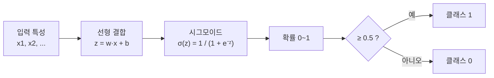
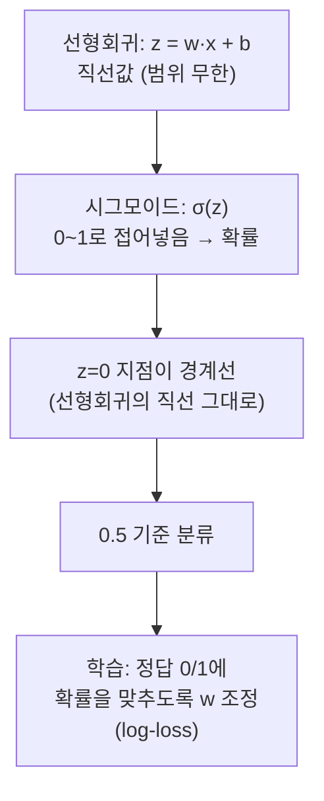
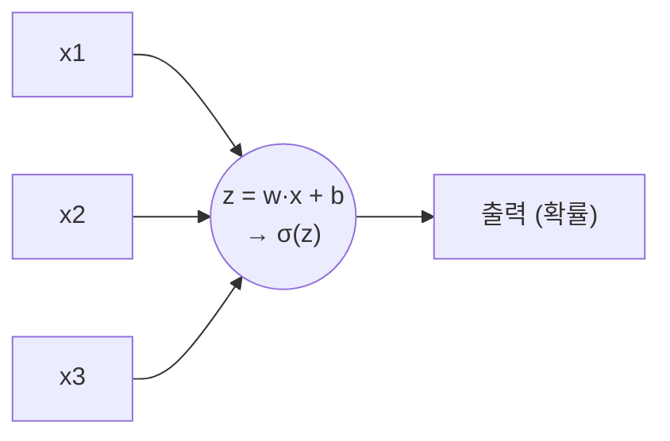
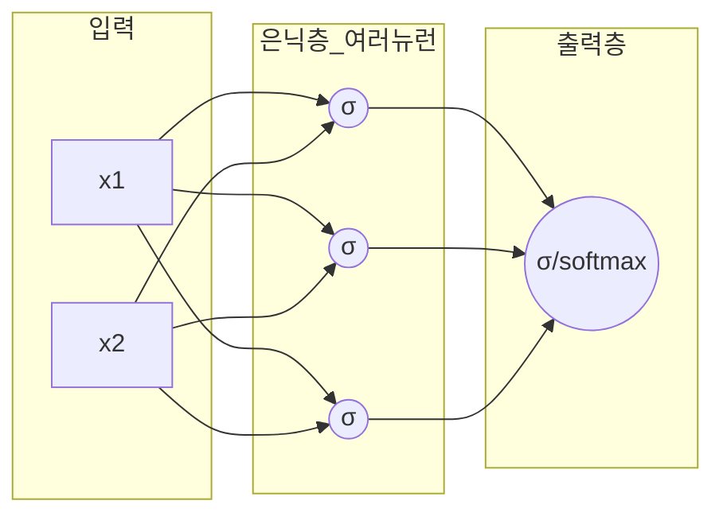

# 로지스틱 회귀 (Logistic Regression)

> 관련 문서:
> - 시그모이드·softmax: [activation_functions.md](./activation_functions.md)
> - 모델 종목 비교(선형회귀 vs 로지스틱 vs SVM): [model_comparison.md](./model_comparison.md)
> - 딥러닝 코드: [`../deep_learning/linear_regression.py`](../deep_learning/linear_regression.py)

## 한 줄 요약

> 이름은 "회귀"지만 **실제로는 분류(classification)** 모델.
> **선형회귀로 값을 계산 → 시그모이드로 0~1 확률로 변환 → 0.5 기준으로 분류**한다.

## 선형회귀와 무엇이 다른가

| | 선형회귀 | 로지스틱 회귀 |
|---|---|---|
| 목적 | **숫자 예측** (집값, 무게) | **분류** (스팸/정상, 합격/불합격) |
| 출력 | $-\infty \sim +\infty$ 실수 | **0~1 확률** |
| 마지막 단계 | 그대로 출력 | **시그모이드로 눌러줌** |

## 동작 방식

1. **선형 결합**: 선형회귀처럼 $z = w_1x_1 + w_2x_2 + \dots + b$ 를 계산. 여기까지는 $-\infty \sim +\infty$ 라 확률로 못 씀.
2. **시그모이드**: $\sigma(z) = \dfrac{1}{1+e^{-z}}$ 에 넣으면 **무조건 0~1** 로 눌림 → "클래스 1일 확률".
3. **임계값(0.5) 판정**: 0.5 이상 → 1, 미만 → 0.

## 왜 그냥 선형회귀로 분류하지 않나

선형회귀로 "합격=1, 불합격=0"을 예측하면 1.7, -0.3 같은 값이 나와 **확률로 해석 불가**.
시그모이드가 출력을 0~1로 강제로 가둬주기 때문에 비로소 "확률"이라는 의미가 생기고 경계도 깔끔해진다.

---

## 동작 원리 자세히 — "어떻게 선형회귀로 분류가 되나"

공부시간으로 합격(1)/불합격(0)을 맞추는 예로 단계별로 따라가 본다.

### 1단계 — 선형회귀를 그냥 쓰면 왜 망하나

선형회귀는 $z = w \cdot x + b$ 로 **직선값**을 뱉는다. 합격=1, 불합격=0으로 두고 직선을 맞추면:

| 공부시간 | 선형회귀 출력 | 문제 |
|---|---|---|
| 1시간 | **-0.3** | 0보다 작음 → 확률이 음수?? |
| 5시간 | 0.5 | 그나마 정상 |
| 12시간 | **1.7** | 1보다 큼 → 170% 합격?? |

직선은 위아래로 무한히 뻗으므로 **확률(0~1)로 해석이 안 된다.** 선형회귀로 분류가 안 되는 이유.

### 2단계 — 시그모이드가 그 직선값을 0~1로 "접어 넣는다"

핵심은 선형회귀를 버리는 게 아니라, 그 출력 $z = w\cdot x + b$ 를 **시그모이드에 한 번 더 통과**시키는 것:

$$\sigma(z) = \frac{1}{1 + e^{-z}}$$

| $z$ (선형회귀 출력) | $\sigma(z)$ |
|---|---|
| $-\infty$ | → 0 |
| **0** | **0.5** |
| $+\infty$ | → 1 |

아무리 큰 값(1.7→0.85)도 음수(-0.3→0.43)도 시그모이드를 지나면 **반드시 0~1 안으로 접혀** 들어간다. 이제 진짜 확률이 됐다.

### 3단계 — 경계선은 어디서 생기나

시그모이드는 **$z = 0$ 일 때 정확히 0.5** 를 준다.

> **분류 경계 = 확률 0.5가 되는 지점 = $z = w \cdot x + b = 0$ 인 곳.**

즉 **선형회귀가 만든 직선($w\cdot x + b = 0$)이 그대로 분류 경계선**이 된다.

- 직선 위쪽($z>0$) → 확률 0.5 넘음 → **클래스 1**
- 직선 아래쪽($z<0$) → 확률 0.5 미만 → **클래스 0**

**그래서 "선형회귀로 분류가 된다"가 성립한다** — 직선은 선형회귀가 긋고, 시그모이드는 그 직선을 "넘었냐/못 넘었냐"의 확률로 번역만 한다.

### 4단계 — 학습 (w, b를 어떻게 정하나)

선형회귀는 "예측값과 실제 숫자의 차이(MSE)"를 줄였다. 로지스틱 회귀는 목표가 바뀐다:

> **실제 정답이 1인 데이터엔 확률을 1에 가깝게, 0인 데이터엔 0에 가깝게** 만드는 $w, b$를 찾는다.
> (이 오차 측정이 **log-loss / 크로스 엔트로피**)

| 실제 정답 | 모델이 낸 확률 | 잘했나? |
|---|---|---|
| 합격(1) | 0.9 | 굿 (벌점 작음) |
| 합격(1) | 0.2 | 큰일 (벌점 큼) → $w$ 수정 |

경사하강법으로 벌점을 줄이며 $w, b$를 조정 → 경계 직선의 위치·기울기가 데이터에 맞게 옮겨간다.

### 한 장 요약

> **선형회귀가 직선을 긋고 → 시그모이드가 그 직선을 '확률'로 번역하고 → 0.5 경계로 자른다.**
> 직선을 만드는 엔진은 끝까지 선형회귀라서 "선형회귀로 분류한다"가 맞는 말이다.

## 다중 클래스는?

기본 로지스틱 회귀는 **2개 클래스(이진 분류)** 용. 클래스가 3개 이상이면 시그모이드 대신
**softmax** 로 확장한다 (→ [activation_functions.md](./activation_functions.md)). 그래서 로지스틱 회귀가 딥러닝 분류로 자연스럽게 이어진다.

---

## 로지스틱 회귀 = 딥러닝 뉴런 1개

로지스틱 회귀는 **딥러닝 뉴런(neuron) 한 개와 수학적으로 똑같다.**

| 로지스틱 회귀 | 딥러닝 뉴런 |
|---|---|
| $z = w \cdot x + b$ (선형 결합) | **가중치 합 (weighted sum)** |
| $\sigma(z)$ (시그모이드) | **활성화 함수 (activation)** |

> **뉴런 = 가중치 합 + 활성화 함수.** 로지스틱 회귀와 글자 그대로 같은 식이다.

### 딥러닝은 여기에 무엇을 더했나

로지스틱 회귀는 뉴런이 **딱 1개**. 딥러닝은 이걸 **쌓고(층) 옆으로 늘린 것(여러 뉴런)** 일 뿐이다.

| | 로지스틱 회귀 | 딥러닝 (신경망) |
|---|---|---|
| 뉴런 수 | 1개 | 수백~수억 개 |
| 층 | 1층 (입력→출력 바로) | 여러 층 (은닉층 쌓음) |
| 표현력 | **직선 경계만** | 곡선·복잡한 경계 |
| 학습 방식 | 경사하강법 | 경사하강법 + **역전파** |

### 핵심 직관

> **딥러닝 = 로지스틱 회귀를 수천 개 쌓아 올린 것.**

학습 사다리:

**시그모이드 → 로지스틱 회귀(뉴런 1개) → 다층 신경망 → 딥러닝**

- 단일 뉴런으로는 **직선 경계**밖에 못 그음 (XOR 같은 문제 못 풂)
- 은닉층을 쌓으면 직선들을 조합해 **어떤 복잡한 경계도** 그릴 수 있음 → 이것이 딥러닝의 힘

딥러닝 코드([`linear_regression.py`](../deep_learning/linear_regression.py))의 `Dense` 층 하나하나가
"로지스틱 회귀 여러 개 묶음"이다. `activation='sigmoid'` 를 주면 글자 그대로 로지스틱 회귀 뉴런이 된다.
