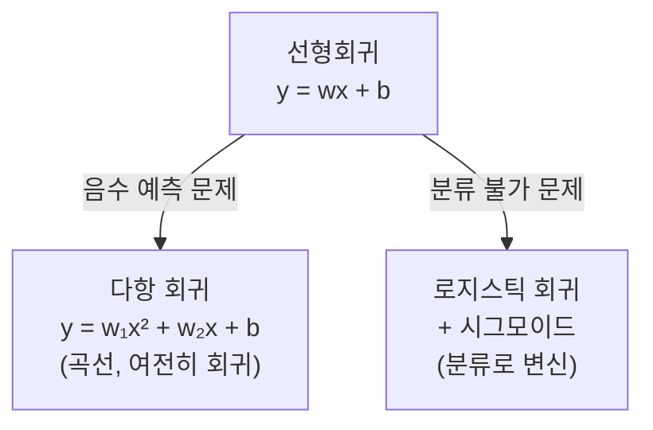
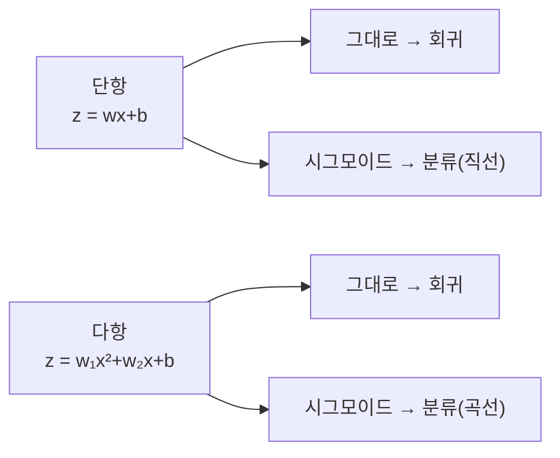
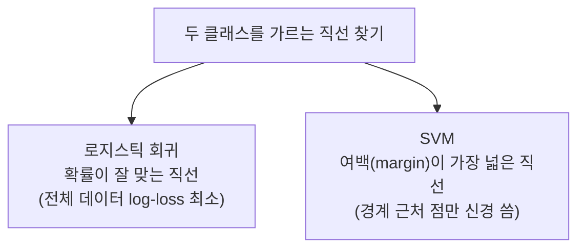
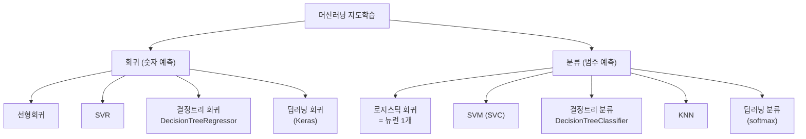
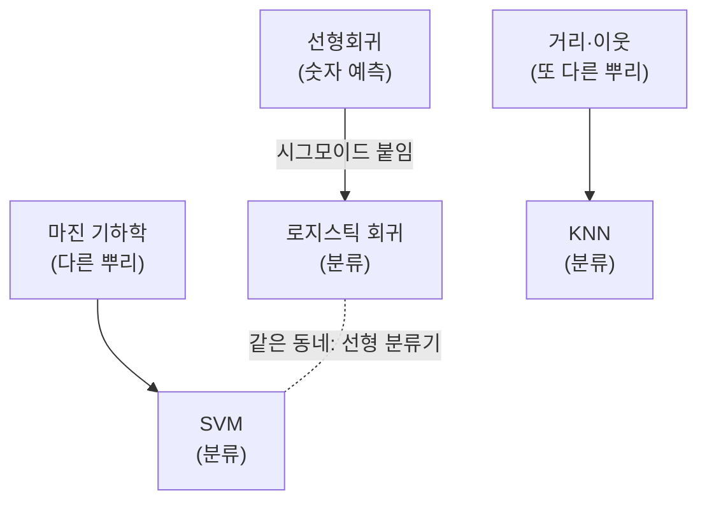
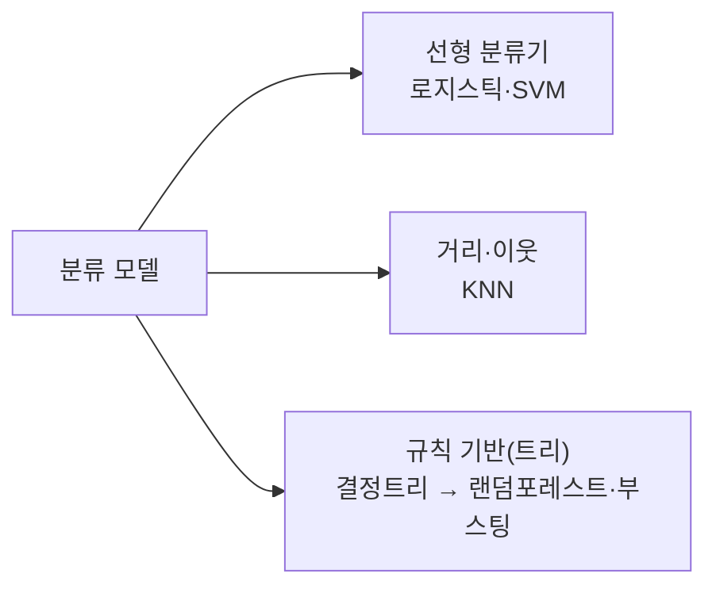

# 모델 비교 — 선형회귀 vs 로지스틱 회귀 vs SVM

> 관련 문서:
> - [logistic_regression.md](./logistic_regression.md)
> - [svm.md](./svm.md)
> - [decision_tree.md](./decision_tree.md)
> - [deep_learning_linear_regression.md](./deep_learning_linear_regression.md)

## 먼저 — 셋은 같은 일을 하지 않는다

| 모델 | 하는 일 | 서로 비교 가능? |
|---|---|---|
| **선형회귀** | 회귀 (숫자 예측) | — |
| **로지스틱 회귀** | 분류 | ✅ |
| **SVM (SVC)** | 분류 | ✅ |

> **"로지스틱 회귀/SVM이 선형회귀보다 성능 좋냐"** 는 질문은 성립하지 않는다.
> **"집값 예측기가 스팸 분류기보다 정확하냐"** 처럼 종목이 다르다 — 선형회귀는 애초에 분류를 못 한다.
>
> 직접 비교가 되는 건 **로지스틱 회귀 vs SVM** (둘 다 분류기).

## 선형회귀의 두 가지 보완 — 다항 회귀 vs 로지스틱 회귀

> 관련 코드:
> - 단점(음수 예측): [`../../20260605/skilearn_linear_regression.py`](../../20260605/skilearn_linear_regression.py)
> - 다항 회귀: [`../../20260605/skilearn_multilinear_regression.py`](../../20260605/skilearn_multilinear_regression.py)

선형회귀 $y = wx + b$ 에는 두 가지 다른 한계가 있고, **보완책도 둘로 갈린다.** (자주 헷갈리는 지점)

### 한계 1 — 음수 예측 (회귀 문제) → 다항 회귀로 보완

농어 길이로 무게를 직선으로 예측하면, **작은 농어**에서 무게가 **음수**로 나온다.
무게가 음수일 순 없으니 직선은 틀린 모델이다.

```python
# skilearn_linear_regression.py
# 직선 방정식의 critical 한 문제. 음수 예측값이 나올 수도 있다.
```

보완은 **$x^2$ 특성을 추가한 다항 회귀** — 곡선이 위로 휘어 음수를 피하고 더 정확해진다.

```python
# skilearn_multilinear_regression.py
train_poly = np.column_stack((train_x**2, train_x))   # x² 특성 추가
Multi_LR_model.fit(train_poly, train_y)               # score 0.977 (직선보다 향상)
```

| | 직선 회귀 | 다항 회귀 ($x^2$ 추가) |
|---|---|---|
| 모델 | $y = wx + b$ | $y = w_1x^2 + w_2x + b$ |
| 모양 | 곧은 직선 | **위로 휘는 곡선** |
| 작은 길이에서 | 아래로 내려가 **음수** | 휘어 올라가 **음수 회피** |

> 여전히 **회귀**(숫자 예측)다. 종목은 안 바뀐다 — "회귀를 더 잘하게" 만든 것.
> 같은 다항 특성 아이디어가 [deep_learning_linear_regression.md](./deep_learning_linear_regression.md)에도 쓰인다.

### 한계 2 — 분류 불가 (출력이 0~1이 아님) → 로지스틱 회귀로 보완

선형회귀 출력은 1.7, -0.3처럼 0~1을 벗어나 **확률(분류)로 못 쓴다.**
보완은 **시그모이드를 붙인 로지스틱 회귀** → 출력을 0~1로 눌러 분류가 가능해진다. (→ [logistic_regression.md](./logistic_regression.md))

### 헷갈리지 말 것 — 방향이 다르다

| 보완하는 한계 | 보완책 | 방법 | 바뀐 종목 |
|---|---|---|---|
| 음수 예측 (회귀) | **다항 회귀** | $x^2$ 특성 추가 (곡선) | 회귀 → **회귀** (그대로) |
| 분류 불가 | **로지스틱 회귀** | 시그모이드 (0~1) | 회귀 → **분류** |



> **다항 회귀 = 회귀를 더 잘하게**, **로지스틱 회귀 = 분류를 할 수 있게.** 둘 다 선형회귀를 보완하지만 목적이 정반대다.

### 주의 — "다항이냐 로지스틱이냐"는 둘 중 하나 고르기가 아니다

위에서 둘이 "갈린다"고 했지만, 이건 **입력 형태 대결이 아니라 출력(회귀 vs 분류) 대결**이다.
모델은 사실 **독립된 두 축**으로 정해진다:

| 축 | 무엇을 정하나 | 선택지 |
|---|---|---|
| **축 1: 입력 형태** | $z$를 어떻게 만드나 | 단항 / 다중 / 다항 |
| **축 2: 출력 처리** | $z$를 어떻게 내보내나 | 그대로(회귀) / 시그모이드(분류) |

두 축은 자유롭게 조합된다 — **로지스틱 회귀는 단항에만 되는 게 아니다.**

| 입력 \ 출력 | 그대로 → 회귀 | 시그모이드 → 분류 |
|---|---|---|
| **단항** $wx+b$ | 단순 선형회귀 | 로지스틱 회귀 (**직선** 경계) |
| **다항** $w_1x^2+w_2x+b$ | 다항 회귀 | 로지스틱 회귀 (**곡선** 경계) |



> **로지스틱 회귀 = "출력에 시그모이드를 씌운다"** 는 뜻일 뿐, 입력이 단항/다중/다항인지와 무관하다.
> "곡선으로 분류"하고 싶으면 **다항 특성 + 로지스틱**을 함께 쓰면 된다.

## SVM과 로지스틱 회귀의 관계

둘 다 **"직선(평면)으로 클래스를 가르는" 선형 분류기**라는 같은 가족이다.
차이는 **"어떤 직선을 좋은 직선으로 보느냐"**.



| | 로지스틱 회귀 | SVM |
|---|---|---|
| 무엇을 최적화 | **확률**이 잘 맞게 (log-loss) | **마진(여백)** 이 최대가 되게 |
| 어떤 점을 보나 | 모든 데이터 | **경계 근처 점(서포트 벡터)만** |
| 출력 | 확률 (0~1) | 클래스 (확률은 기본 X) |
| 곡선 경계 | 기본은 직선만 | **커널로 곡선 가능** ← 강점 |

> [svm.md](./svm.md)의 **RBF 커널, C, gamma** 가 바로 이 "마진"과 "곡선 경계"를 조절하는 손잡이다.

## 어느 게 성능이 좋나 — "데이터에 따라 다르다"

공짜 점심은 없다(No Free Lunch). 다만 경향은 있다.

| 상황 | 유리한 쪽 |
|---|---|
| 경계가 거의 직선, 데이터 많음 | **로지스틱 회귀** (빠르고 충분) |
| 경계가 복잡한 곡선 | **SVM + RBF 커널** |
| "확률"이 필요함 (이거 80% 스팸) | **로지스틱 회귀** |
| 데이터 적고 차원 높음 | **SVM** (마진 덕에 과적합에 강함) |
| 데이터 수십만 개 이상 | **로지스틱 회귀** (SVM은 느려짐) |

## SVM도 회귀를 할 수 있다

분류용은 **SVC**, 회귀용은 **SVR(Support Vector Regression)** 이 따로 있다.

| 작업 | "선형" 계열 | "마진/커널" 계열 |
|---|---|---|
| 회귀 (숫자) | 선형회귀 | **SVR** |
| 분류 | 로지스틱 회귀 | **SVC** |

## 전체 지도 (지금까지 배운 모델)



## 모델의 혈통 — 누가 누구의 친척인가

같은 "분류" 종목 안에서도 **출신(체질)** 이 갈린다.



- **로지스틱 회귀**: 선형회귀의 **직계 후손**. 선형 결합에 시그모이드만 붙여 분류로 변신.
- **SVM**: 출발점부터 다른 **마진 기하학** 혈통. 하지만 결과물(직선 경계)이 비슷해 로지스틱 회귀와 **같은 동네(선형 분류기)**.
- **KNN**: **거리·이웃** 혈통. 경계식 자체가 없는 **완전히 다른 동네**.

### 동네별 체질 비교

| 동네 | 모델 | 어떻게 분류하나 | fit 때 하는 일 |
|---|---|---|---|
| **선형 분류기** | 로지스틱 회귀, SVM | 직선(평면)을 그어 가름 | 경계식 $w\cdot x+b$ 학습 |
| **사례 기반(거리)** | KNN | 가까운 이웃 k개 다수결 | **데이터를 외우기만** (게으른 학습) |
| **규칙 기반(트리)** | 결정트리 | if-else 질문으로 영역 분할 | 분기 질문 학습 ([decision_tree.md](./decision_tree.md)) |

> **KNN 메모**: 거리를 재므로 **스케일링이 필수**다 (단위가 큰 축이 거리를 독점). 식을 안 만들고
> 예측 시점에 계산하는 **게으른 학습(lazy)** · **사례 기반(instance-based)** 모델.

### 결정트리 동네 자세히

결정트리는 직선도 안 긋고(선형 동네 아님) 거리도 안 잰다(KNN 동네 아님).
대신 **"이 값이 X보다 크냐?" 라는 질문을 연쇄로 던져 공간을 네모로 자른다.**

| | 선형 분류기 | KNN | 결정트리 |
|---|---|---|---|
| 경계 모양 | 직선/평면 | 이웃 따라 울퉁불퉁 | **계단형 네모(축에 수직)** |
| 사고방식 | $w\cdot x+b$ 계산 | 가까운 거 투표 | **연쇄 질문(if-else)** |
| 스케일링 | 필요(KNN·SVM) | 필수 | **불필요** (크기 비교만 함) |
| 해석 | 가중치 | 어려움 | **매우 쉬움 (길 따라 읽으면 끝)** |

> **이 동네의 진짜 가치 — 해석 가능성**: "경도 127 넘고 위도 37.55 아래라서 강서" 처럼
> **분류 이유를 사람이 그대로 읽을 수 있는 유일한 동네**다.
>
> **그리고 앙상블의 출발점**: 결정트리를 여러 개 묶으면 **랜덤 포레스트 · 그래디언트 부스팅(XGBoost 등)** 이
> 된다. 이 강력한 모델들이 모두 이 동네에서 나온다. (개념: [decision_tree.md](./decision_tree.md))



## 핵심 직관

> - 로지스틱 회귀는 **선형회귀의 자식**, SVM은 **옆집에서 온 다른 혈통**, KNN은 **아예 다른 동네(거리·이웃)**
> - 선형회귀 ↔ 로지스틱 회귀/SVM 은 **종목이 다르다** (회귀 vs 분류) → 직접 비교 X
> - 로지스틱 회귀 vs SVM 은 **같은 분류 종목** → 비교 O
> - 차이는 **"확률을 맞추냐(로지스틱)" vs "여백을 넓히냐(SVM)"**, SVM은 **커널로 곡선 경계** 가능
> - "무조건 더 좋은 모델"은 없다 — 데이터 모양과 필요(확률? 곡선? 속도?)에 따라 고른다
